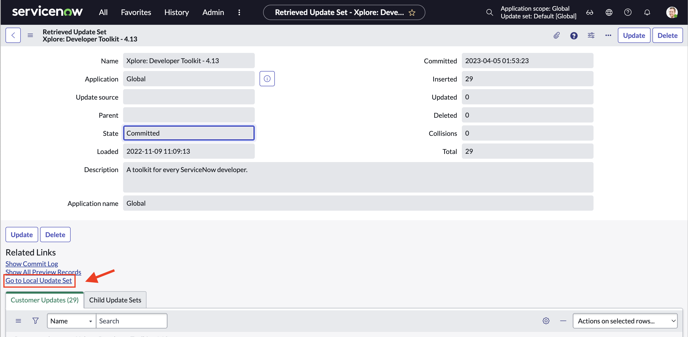

# Go to local / retrieved Update set

[![Contributors][contributors-shield]][contributors-url]
[![Forks][forks-shield]][forks-url]
[![Stargazers][stars-shield]][stars-url]
[![Issues][issues-shield]][issues-url]
[![license-shield]][license-url]

## 📝 Description
Simple UI actions redirecting from Retrieved update set to local update set and in the other way around

## 📂 Installation

1. **Download the update set** from the repository.
2. **Import the update set** into your ServiceNow instance.
3. **Commit the update set** to apply the changes.
4. Test the functionality.

---

## 📢 Contributions
Contributions are welcome! To contribute:
1. **Fork** the repository.
2. Create a new branch (`feature/new-feature`).
3. Make changes and submit a **Pull Request**.

---

## 📜 License
This project is distributed under the **MIT License**. Feel free to use it! 🎉

[contributors-shield]: https://img.shields.io/github/contributors/AlexAlvarez092/SN-Go-To-Local-Retrieved.svg?style=for-the-badge
[contributors-url]: https://github.com/AlexAlvarez092/SN-Go-To-Local-Retrieved/graphs/contributors

[forks-shield]: https://img.shields.io/github/forks/AlexAlvarez092/SN-Go-To-Local-Retrieved.svg?style=for-the-badge
[forks-url]: https://github.com/AlexAlvarez092/SN-Go-To-Local-Retrieved/network/members

[stars-shield]: https://img.shields.io/github/stars/AlexAlvarez092/SN-Go-To-Local-Retrieved.svg?style=for-the-badge
[stars-url]: https://github.com/gAlexAlvarez092/SN-Go-To-Local-Retrieved/stargazers

[issues-shield]: https://img.shields.io/github/issues/AlexAlvarez092/SN-Go-To-Local-Retrieved.svg?style=for-the-badge
[issues-url]: https://github.com/AlexAlvarez092/SN-Go-To-Local-Retrieved/issues

[license-shield]: https://img.shields.io/github/license/AlexAlvarez092/SN-Go-To-Local-Retrieved.svg?style=for-the-badge
[license-url]: https://github.com/AlexAlvarez092/SN-Go-To-Local-Retrieved/blob/master/LICENSE.txt
